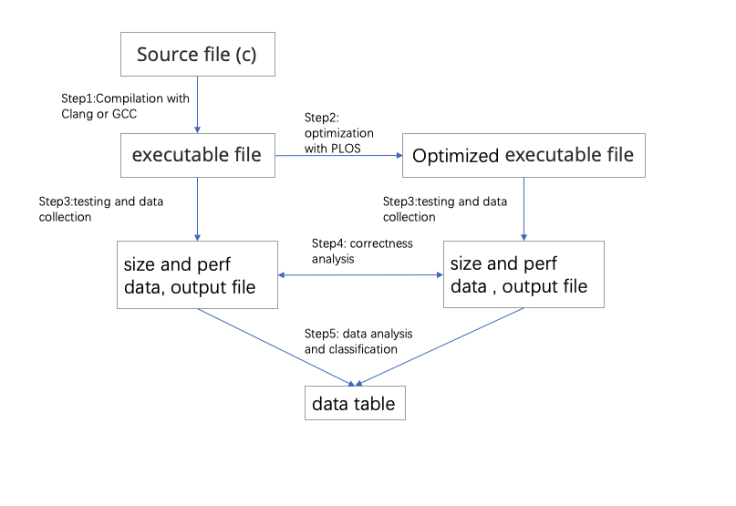
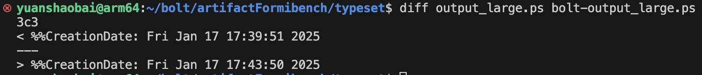

PLOS: Post-link Outlining for Code Size Reduction

Introduction

This repository is associated with the paper “Post-link Outlining for Code Size Reduction”, which presents a novel approach to reducing the size of compiled binaries through a post-link optimization technique.

Code size reduction is critical for resource-constrained environments, such as embedded systems and IoT devices, where memory and storage are limited.

Our method leverages post-link outlining to identify and extract repeated instruction sequences across the entire binary, creating reusable functions that replace the original sequences. This process occurs after the linking stage, enabling whole-program analysis and ensuring compatibility with various compiler front-ends and intermediate optimizations.

The input to our approach is a binary executable file, and the output is an optimized binary executable file with reduced code size.

This repository provides the implementation of our approach, together with all necessary scripts and instructions to reproduce the results presented in the paper. Users can analyze the impact of post-link outlining on code size reduction for their own binaries or the included benchmark set.

Paper and Artifact
	•	Paper: Post-link Outlining for Code Size Reduction
	•	Artifact: Zenodo Artifact Package

Artifact Requirements

1. Operating System and Architecture
	•	Operating System: Ubuntu 22.04
	•	Architecture: AArch64

The artifact has not been validated on other operating systems or architectures. For smooth operation, it is recommended to use the same configuration as specified above.

2. Hardware Requirements
	•	Memory: At least 8GB RAM
	•	Storage: At least 64GB of available hard disk space
	•	CPU: AArch64 architecture with a recommended clock speed of 2.2GHz or higher

3. Environment and Tools
	•	Linux Environment
	•	make command available (ensure make is installed)
	•	perf tool installed with the necessary permissions to run (e.g., sudo or sufficient privilege level)
	•	Python environment with the following libraries:
	•	os
	•	re
	•	subprocess
	•	argparse
	•	openpyxl (including Workbook and load_workbook)

Usage Guide

1. Extract the Artifact Package

First, unzip the artifact_PLOS.tar package by running:

tar -xzvf artifact_PLOS.tar

This will create the artifact_PLOS folder. After extraction, navigate into the artifact_PLOS directory:

cd artifact_PLOS

2. Set Up Environment Variables

Execute the env.sh script to set the necessary environment variables:

source env.sh

3. Navigate to artifactFormibench

Move into the artifactFormibench directory:

cd artifactFormibench

4. Run the Script

Execute the following command to start the process:

python run_makefiles.py

After completing the above steps, you will obtain all the required data.

Results Explanation

After the script completes execution, five Excel files will be generated:
	•	figure5sdata.xlsx
	•	figure6sdata.xlsx
	•	figure7sdata.xlsx
	•	figure8sdata.xlsx
	•	figure9sdata.xlsx

The content of each file corresponds to the raw data for the figures in the paper. For example:
	•	figure5sdata.xlsx contains the raw data for Figure 5
	•	figure6sdata.xlsx contains the raw data for Figure 6
	•	figure7sdata.xlsx contains the raw data for Figure 7
	•	figure8sdata.xlsx contains the raw data for Figure 8
	•	figure9sdata.xlsx contains the raw data for Figure 9

By comparing the data in these tables, users can validate the experimental results presented in the paper.

Script Execution Flow

Please replace the image path below with the actual path in your repository.

File Structure

The project has the following directory structure:
	•	llvm-project/
Contains the LLVM toolchain required for the artifact. This directory includes the necessary LLVM libraries and tools that the artifact depends on for compiling, optimizing, and generating code.
	•	gcc/
Contains the GNU toolchain required for the artifact.
	•	env.sh
This is the environment configuration script. It sets up the necessary environment variables, paths, and other configurations to ensure that the artifact can be built and executed properly.
	•	artifactFormibench/
This directory contains the benchmark and testing scripts. It includes a variety of scripts designed to test the artifact’s functionality, performance, and correctness under different conditions.

Toolchain Versions

The artifact relies on specific versions of Clang and GCC for building and compiling code:
	•	Clang version: 18.0.0
This version of Clang is used for the LLVM-based toolchain, ensuring compatibility with the LLVM optimizations and features required for the artifact.
	•	GCC version: 15.0.0
This version of GCC is used for the GNU toolchain, providing the necessary compiler and linker for the artifact’s build process.

Additional Notes

1. False Positive Errors in Correctness Checks for Lout Examples
	•	Cause: The inconsistency is due to Lout including a step that prints the current time as part of its output. Since the time is generated dynamically, it may differ between runs, causing a mismatch in the output.
	•	Solution: You can manually use the diff command to compare the outputs while ignoring the time-related sections, and verify correctness by focusing on the functional and data consistency.

Please replace the image path below with the actual path in your repository.

2. Missing Data Issue
	•	Cause: Some data may be missing because the moutline optimization in the Clang compiler can introduce errors in the test results.
	•	Solution: The missing data is invalid and should be excluded from the analysis. Avoid using the affected tests for any critical performance or correctness evaluations.

Citation

If you use this artifact or reference this work, please cite the paper:

@inproceedings{plos_cc2025,
  title={Post-link Outlining for Code Size Reduction},
  author={Yuan, Shaobai and He, Jihong and Xie, Yihui and Wang, Feng and Zhao, Jie},
  booktitle={Proceedings of the 34th ACM SIGPLAN International Conference on Compiler Construction},
  year={2025},
  doi={10.1145/3708493.3712692}
}
